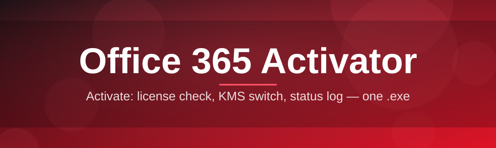

# office-365-configurator-tool 🔑✨

  

*The friendly little tool that takes Office 365 licensing from "why won't this just work" to "oh, that was easy."*

  

---

## 🧭 Overview

Let's be honest for a second: managing Office 365 activation across personal machines, lab computers, or a small office fleet is one of those chores that always feels harder than it should be. You open a support article, it references three different portals, half the terminology assumes you already know what a KMS host is, and by the time you're done you've spent forty minutes on something that should've taken four. That gap — between "Microsoft's official process" and "what a regular person actually needs" — is exactly the space **office-365-configurator-tool** lives in.

This project is a lightweight Windows configurator built for people who just want their Office 365 suite properly licensed and talking to the right activation servers without becoming a systems administrator overnight. It wraps the fiddly, easy-to-misconfigure parts of Office 365 activation into a clean interface: pick your product, click through a short wizard, and let the tool handle the plumbing. No PowerShell essays to paste, no registry spelunking, no five-tab browser research session.

Who is this for? IT hobbyists managing a handful of machines, small business owners without a dedicated helpdesk, students setting up a fresh laptop before the semester starts, and sysadmins who want a repeatable, predictable configurator instead of hand-rolling scripts every single time. If you've ever muttered "there has to be a simpler way to do Office 365 activation," this tool is our answer to that muttering.

> [!NOTE]
> office-365-configurator-tool is a standalone Windows utility. Grab it from the landing page above — there's no package manager step, no build pipeline for end users, just a direct download.

---

## 🔥 What Makes This Thing Actually Useful

Here's the problem/solution rundown — what used to be annoying, and how this tool smooths it over.

- **One-window activation flow** — Instead of hopping between five Microsoft support pages, everything lives in a single guided window. What sucked: tab overload. What this fixes: one place, one flow, done.

- **Automatic product detection** — The tool scans your installed Office 365 suite and pre-fills the right configuration instead of asking you to guess your build channel. No more "wait, am I on Semi-Annual or Monthly?"

- **Retail-to-volume license bridging** — Cleanly reconfigures license paths between activation modes without leaving orphaned registry entries behind, which is usually the actual root cause of "it says activated but Word still nags me."

- **Silent / unattended mode** — Toggle a single switch and the configurator runs through its steps without popping dialogs, ideal for provisioning multiple machines back to back.

- **Built-in activation status dashboard** — See product ID, license state, and expiration windows at a glance instead of digging through `slmgr` output line by line.

- **Rollback safety net** — Every configuration change is snapshotted first, so if something looks off you can revert to the previous licensing state in one click.

- **Offline-friendly design** — The tool is a standalone executable with no background services or telemetry daemons installed onto your system.

- **Log export for troubleshooting** — Generates a clean, shareable log file so if you do need help, you're not screenshotting a wall of command-line text.

> [!TIP]
> Run the status dashboard first before touching anything. Half of "my Office 365 won't activate" cases turn out to be an already-valid license that just needs a refresh, not a full reconfiguration.

---

## 🚀 How to Get Started

1. **Visit the landing page.** Click the download button above — it takes you straight to the project's page where the current build lives.

2. **Download the build.** It's a single portable file — no installer wizard, no bundled toolbars, nothing riding along that you didn't ask for.

3. **Run it.** Double-click, let Windows SmartScreen do its usual "are you sure" dance (this is normal for unsigned indie tools), and the configurator opens.

4. **Follow the on-screen wizard.** Pick your Office 365 edition, review the detected license state, and let the tool apply the configuration. That's it — genuinely.

> [!IMPORTANT]
> Close all Office 365 applications (Word, Excel, Outlook, etc.) before running the configurator. Active Office processes can lock the licensing files the tool needs to write to.

---

## 🖥️ System Requirements

| Requirement | Details |
|---|---|
| OS | Windows 10 (64-bit) or Windows 11 |
| Office | Any Office 365 / Microsoft 365 subscription channel installation |
| Disk space | Under 50 MB — it's genuinely tiny |
| Dependencies | None. Fully standalone, no .NET add-ons or runtime installs required |
| Admin rights | Recommended, since licensing changes touch protected system paths |
| Internet | Needed briefly during the activation handshake step |

  

---

## ⚙️ How It Works

The internal flow is intentionally simple — no black-box magic, just a clean sequence of well-defined steps:

1. **Detect** — The tool scans installed Office 365 components and current license state.

2. **Select** — You confirm which product and activation path applies to your setup.

3. **Configure** — The configurator writes the correct licensing configuration, replacing anything mismatched.

4. **Verify** — It re-checks activation status to confirm the change actually took effect.

5. **Report** — A summary (and optional log export) tells you exactly what changed.

📦 What actually gets touched on my system?

The configurator only modifies Office 365 licensing configuration paths and activation-related registry keys tied to the Office suite itself. It does not touch unrelated system settings, user files, or other installed applications.

---

## 🛟 Troubleshooting

**Q: The tool says "activated" but Office still shows an unlicensed banner.**
A: Restart the Office application fully (check Task Manager for lingering `WINWORD.EXE` / `EXCEL.EXE` processes) — the banner often just hasn't refreshed yet.

**Q: Windows SmartScreen is blocking the download.**
A: This is expected for smaller independent tools without a large-scale code-signing budget. Choose "More info" → "Run anyway" if you trust the source, which you can verify via the landing page.

**Q: My antivirus flagged the executable.**
A: Licensing configurators frequently trip heuristic detection because they modify activation-related registry keys — the same behavior legitimate tools and malicious ones can share on paper. Check the SHA256 hash listed on the landing page against your download.

**Q: Activation worked, but it reverted after a Windows update.**
A: Some cumulative updates reset volume licensing tokens. Just re-run the configurator's Verify step — it's a thirty-second fix, not a full reconfiguration.

**Q: Can I use this on a Windows Server edition?**
A: It's built and tested specifically for Windows 10/11 desktop editions. Server SKUs aren't officially supported and may behave unpredictably.

**Q: The status dashboard shows a different build channel than I expected.**
A: This usually means your Office 365 install auto-updated between channels. Re-run Detect to refresh the reading.

---

## 🎨 UI / UX Details

> [!TIP]
> Press `Ctrl+D` from the main window to jump straight to the status dashboard — it's the most-used screen for a reason.

- **Themes:** Light, Dark, and an auto mode that follows your Windows theme setting.

- **Keyboard shortcuts:**

  | Shortcut | Action |
  |---|---|
  | `Ctrl+D` | Open status dashboard |
  | `Ctrl+R` | Re-run detection |
  | `Ctrl+L` | Export log |
  | `Ctrl+Z` | Roll back last configuration |
  | `F1` | Open in-app help |

- **Settings panel:** Toggle silent mode, choose default activation path, and set log verbosity — all persisted between launches in a small local config file, nothing sent anywhere.

- **Accessibility:** High-contrast mode support and full keyboard navigation across every wizard step.

---

## 🤝 Contributing & Community

This project grew because people kept sharing fixes, edge cases, and small UI tweaks — and that's still very much how it moves forward.

> [!NOTE]
> Found an edge case with a specific Office 365 build channel? Open an issue with your Office version and a log export — that context makes fixes dramatically faster.

- Bug reports and feature requests are welcome via Issues.
- Pull requests should target a single change — smaller PRs get reviewed and merged faster.
- Discussion around new activation-path edge cases is always encouraged; this domain has a lot of "it depends" scenarios.

---

## 📜 License

Released under the [MIT License](LICENSE), 2026. Use it, fork it, adapt it — just keep the license notice intact.

---

## ⚠️ Disclaimer

> [!WARNING]
> This tool is provided "as is," for configuring and managing licensing on Office 365 installations you are authorized to manage. You're responsible for ensuring your usage complies with your applicable Microsoft licensing agreement. The maintainers provide no warranty and accept no liability for misuse or unintended system changes — always back up important data before making licensing-level modifications.

---

